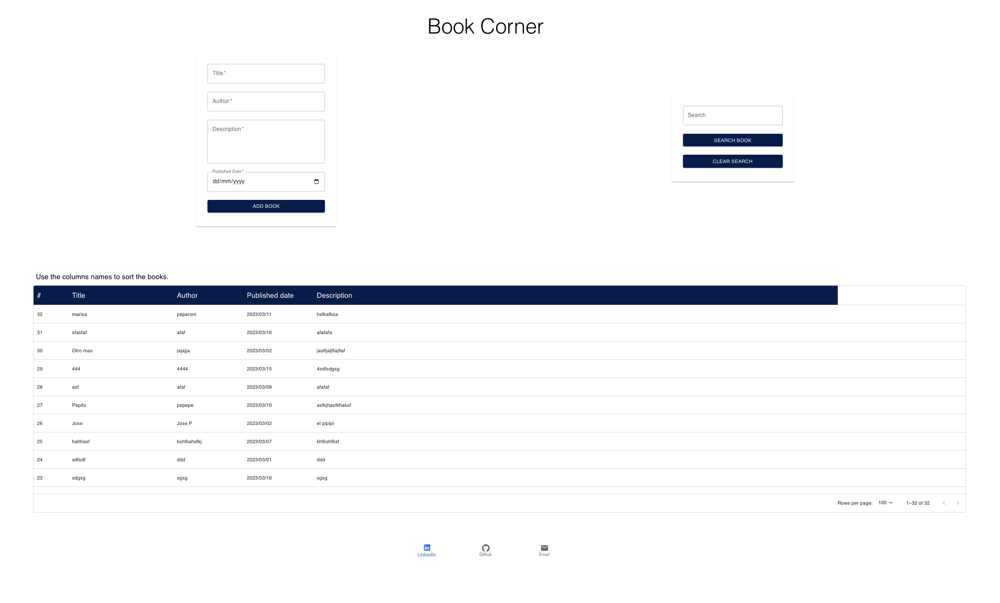

# Elucidat Fullstack code challenge - my Solution

## Description

The task was to create a simple web application that allows users to search for and view information about books using Laravel and React. 

This code challenge was for demonstrate my Laravel and React experience.

## Screenshot

## Table of Contents   
  - [Description](#description) 
  - [Screenshot](#screenshot) 
  - [Installation](#installation) 
  - [Usage](#usage)
  - [License](#license)
  - [Contributing](#contributing)
  - [Credits](#credits)
  - [Questions](#questions)

##  Installation 

     - No installation required.

##  Usage 

When enter the site a table off books stored will show.
Use the form to add new books. When a new book is added the table of books will rerender.
Use the search box to search for books base on Title or Author. Use a blank search to see tle full list again. Use the clear search button to clear last search and see the full list again. 
Use the name of field to sort the book data. 
Use the link on the footer to see more of my work and follow me. 

##  License 
MIT License   
                        Copyright 2023 sabrina-martorelli   
                        Permission is hereby granted, free of charge, to any person obtaining a copy of this software and associated documentation files (the "Software"), to deal in the Software without restriction, including without limitation the rights to use, copy, modify, merge, publish, distribute, sublicense, and/or sell copies of the Software, and to permit persons to whom the Software is furnished to do so, subject to the following conditions:  
                        The above copyright notice and this permission notice shall be included in all copies or substantial portions of the Software.   
                        THE SOFTWARE IS PROVIDED "AS IS", WITHOUT WARRANTY OF ANY KIND, EXPRESS OR IMPLIED, INCLUDING BUT NOT LIMITED TO THE WARRANTIES OF MERCHANTABILITY, FITNESS FOR A PARTICULAR PURPOSE AND NONINFRINGEMENT. IN NO EVENT SHALL THE AUTHORS OR COPYRIGHT HOLDERS BE LIABLE FOR ANY CLAIM, DAMAGES OR OTHER LIABILITY, WHETHER IN AN ACTION OF CONTRACT, TORT OR OTHERWISE, ARISING FROM, OUT OF OR IN CONNECTION WITH THE SOFTWARE OR THE USE OR OTHER DEALINGS IN THE SOFTWARE.
##  Contributing 
When contributing to this repository, please first discuss the change you wish to make via issue, email, or any other method with the owners of this repository before making a change.

##  Credits

1.https://github.com/elucidat/fullstack-code-challenge

2.https://www.elucidat.com/

##  Questions

 Please contact me at [sabrina.martorelli@gmail.com ](mailto:sabrina.martorelli@gmail.com).
